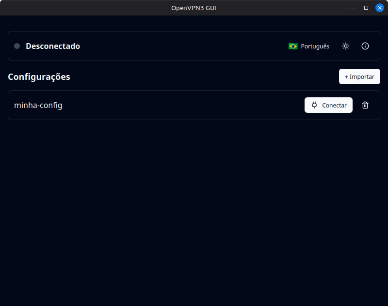
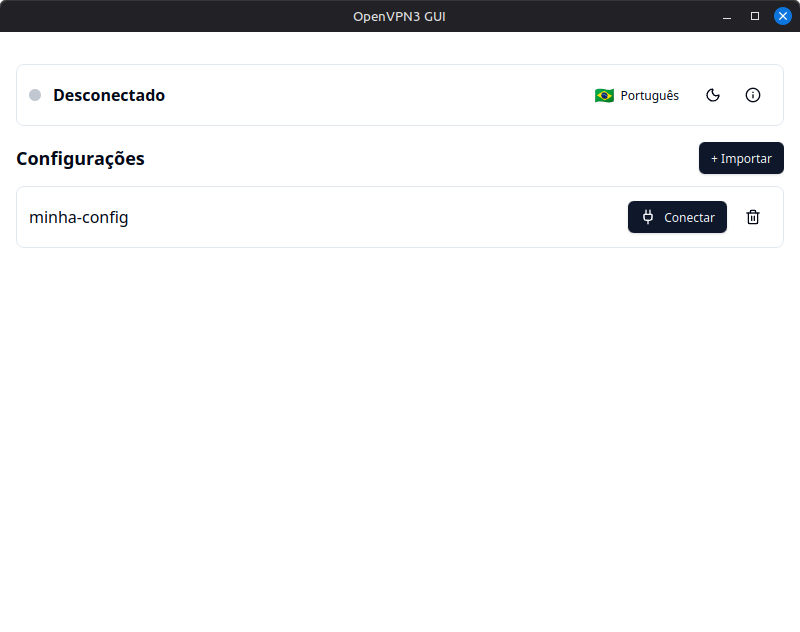
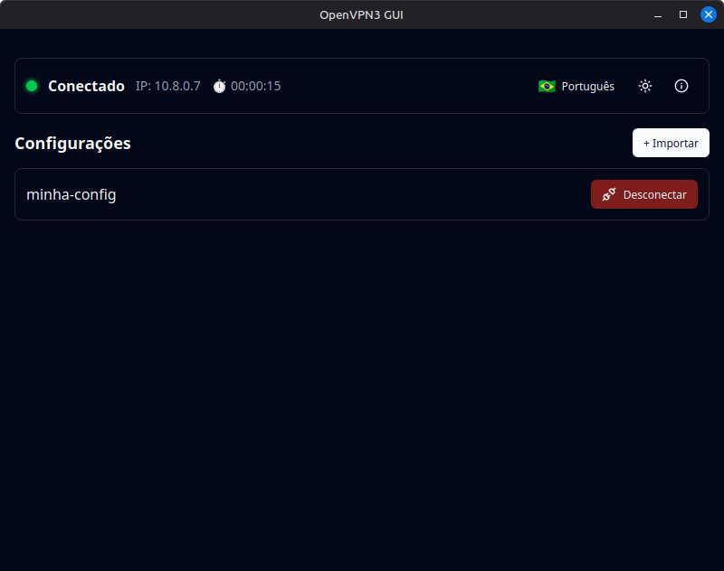
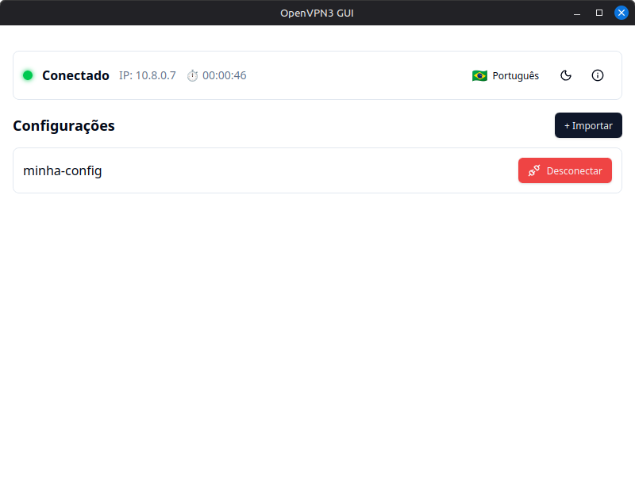

# OpenVPN3 GUI

<p align="center">
  
</p>

<p align="center">
  A lightweight desktop GUI for managing OpenVPN3 connections on Linux.
</p>

<p align="center">
  
  
  
  
</p>

---

## Features

- **Import configurations** (.ovpn/.conf) with name validation and duplicate detection
- **List, connect, disconnect, and remove** VPN configurations
- **Real-time status** — Virtual IP and connection uptime
- **System tray** — Minimize to tray on close; click to restore
- **Dark / Light themes**
- **Multi-language** — English, Português (BR), Español (easily extensible)
- **Loading feedback** — Spinners and toast notifications on all actions

## Screenshots

<p align="center">
  
  
</p>
<p align="center">
  
  
</p>

## Installation

### From .deb (Ubuntu / Linux Mint)

Download the latest `.deb` from [Releases](https://github.com/matheusviegas/openvpn3-gui/releases) and install:

```bash
sudo dpkg -i OpenVPN3.GUI_*.deb
```

### From AppImage

Download the `.AppImage` from [Releases](https://github.com/matheusviegas/openvpn3-gui/releases), make it executable, and run:

```bash
chmod +x OpenVPN3.GUI_*.AppImage
./OpenVPN3.GUI_*.AppImage
```

## Prerequisites

- **openvpn3** installed and configured (`openvpn3 --version`)
- No sudo required — openvpn3 runs as your user via D-Bus

## Development

### Requirements

- Node.js >= 18
- Rust >= 1.77
- System libraries:

  ```bash
  sudo apt install libdbus-1-dev pkg-config libwebkit2gtk-4.1-dev \
    libgtk-3-dev libayatana-appindicator3-dev librsvg2-dev libssl-dev
  ```

### Quick Start

```bash
# Install all dependencies
./scripts/setup.sh

# Run in development mode
./scripts/dev.sh

# Build for production
./scripts/build.sh

# Package as .deb
./scripts/package-deb.sh
```

### Scripts

| Script | Description |
|--------|-------------|
| `./scripts/setup.sh` | Install system deps + Rust + Node deps |
| `./scripts/dev.sh` | Run in dev mode (hot-reload) |
| `./scripts/build.sh` | Production build |
| `./scripts/package-deb.sh` | Generate .deb package |

## Architecture

```
openvpn3-gui/
├── locales/                  # Shared i18n JSON files (frontend + backend)
│   ├── en.json
│   ├── pt-BR.json
│   └── es.json
├── src/                      # Frontend (React + TypeScript)
│   ├── App.tsx               # Main orchestrator
│   ├── components/
│   │   ├── ui/               # Generic shadcn/ui components
│   │   └── app/              # App-specific components
│   ├── locales/index.ts      # Locale registry
│   └── lib/                  # Providers (i18n, theme, utils)
├── src-tauri/                # Backend (Rust + Tauri 2)
│   └── src/
│       ├── lib.rs            # App setup (tray, plugins, window)
│       └── commands/         # Command modules
│           ├── config.rs     # list, import, remove configs
│           ├── session.rs    # connect, disconnect, status
│           └── tray.rs       # Tray language sync
└── scripts/                  # Dev/build automation
```

### Key Decisions

| Decision | Rationale |
|----------|-----------|
| **Tauri 2** over Electron | ~10MB binary vs ~150MB; native webview; Rust backend |
| **std::process::Command** | Wraps openvpn3 CLI directly; no D-Bus binding needed |
| **async connect/disconnect** | `spawn_blocking` prevents UI freeze during slow operations |
| **Shared JSON i18n** | Single source of truth for frontend and backend translations |
| **shadcn/ui + Tailwind** | Consistent, themeable components without heavy dependencies |
| **System tray** | VPN apps should persist in background |

### openvpn3 Commands Used

| Action | Command |
|--------|---------|
| List configs | `openvpn3 configs-list` |
| Import | `openvpn3 config-import --config <path> --name <name> --persistent` |
| Remove | `openvpn3 config-remove --config <name> --force` |
| Connect | `openvpn3 session-start --config <name>` |
| Disconnect | `openvpn3 session-manage --disconnect --config <name>` |
| Status | `openvpn3 sessions-list` + `ip addr show <device>` |

## Adding a New Language

1. Create `locales/<code>.json` (copy `en.json` as template)
2. In `src/locales/index.ts`: import and add entry to the registry
3. In `src-tauri/src/commands/tray.rs`: add match arm for the new locale

## Changing the App Icon

```bash
npx tauri icon path/to/your-icon.svg
```

## Contributing

See [CONTRIBUTING.md](CONTRIBUTING.md) for guidelines.

## License

[MIT](LICENSE)

## Author

**Matheus Souza** — [github.com/matheusviegas](https://github.com/matheusviegas)
